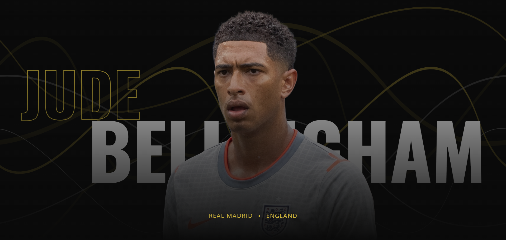

<div align="center">

# Jude Bellingham | The Golden Boy

A web tribute dedicated to the career and achievements of Jude Bellingham. Built with Next.js, this project features scroll animations and an interactive layout.

<br />


<br />



</div>

## Features

- **Cinematic Intro Animation**: A custom GSAP timeline that smoothly transitions typography and SVGs into the main hero view.
- **Smooth Scrolling**: Integrated with Lenis for a buttery-smooth scrolling experience across all devices.
- **Interactive Storytelling**:
  - **Career Journey**: A horizontal-scrolling timeline detailing his rise from Birmingham to Real Madrid and England.
  - **Career Trophies**: A responsive, immersive gallery highlighting his major accolades (Golden Boy, La Liga, Champions League).
  - **The Belligol**: A dramatic video and text overlay section explaining the philosophy behind his iconic celebration and playstyle.
- **Premium Aesthetics**: A custom `#0a0a0a` dark theme paired with `#CFB53B` gold accents, typography driven by *Oswald* and *Geist Sans*, and subtle noise textures.
- **Fully Responsive**: Meticulously crafted layouts ensuring the experience is just as stunning on mobile devices as it is on ultra-wide desktop monitors.

## Tech Stack

- **Framework**: [Next.js](https://nextjs.org/) (React)
- **Styling**: [Tailwind CSS](https://tailwindcss.com/)
- **Animations**: [GSAP](https://gsap.com/) (GreenSock Animation Platform) + ScrollTrigger
- **Scroll Hijacking**: [Lenis](https://lenis.studiofreight.com/) by Studio Freight
- **Fonts**: Google Fonts (Oswald, Geist Sans)

## Getting Started

First, ensure you have Node.js installed on your machine.

1. Clone the repository and navigate into the project directory.
2. Install the dependencies:
   ```bash
   npm install
   ```
3. Run the development server:
   ```bash
   npm run dev
   ```
4. Open [http://localhost:3000](http://localhost:3000) with your browser to see the result.

## Project Structure

Key components can be found in `app/components/`:
- `Hero.tsx`: The animated landing screen.
- `Quote.tsx` & `Stats.tsx`: Parallax overlay statistics.
- `CareerJourney.tsx`: Horizontal scroll timeline.
- `CareerTrophy.tsx`: Trophy showcase gallery.
- `Belligol.tsx`: Cinematic impact section.
- `Socials.tsx` & `Footer.tsx`: Connect links and closing credits.

## Credits

**Made with passion by Ardhan**  
A fan project honoring one of football's brightest talents.
